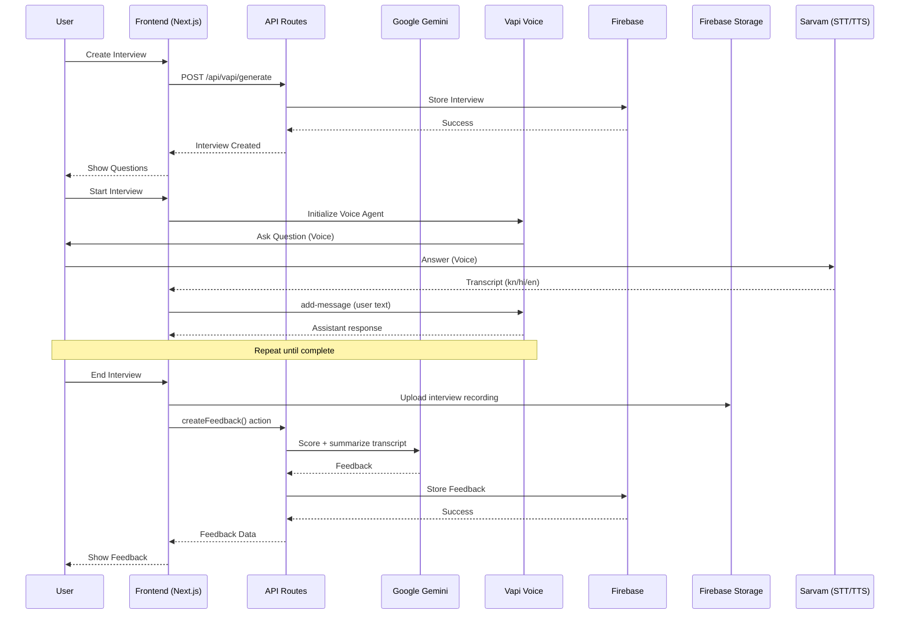

# SkillStack - System Architecture Documentation

## 📊 Executive Summary

**SkillStack / AI SkillFit** is an AI-powered screening prototype for **trade-skill interviews**. It supports **Kannada/Hindi/English voice interaction**, records candidate video, generates structured assessment scores, and assigns a fitment label for downstream decisions.

### What is implemented in this repository (source of truth)

- Trade interview creation using a **built-in question bank** (not AI-generated questions)
- Live voice interview with **Vapi** (LLM agent)
- Kannada/Hindi/English **STT + TTS via Sarvam** (client-side)
- Browser video recording uploaded to **Firebase Storage** + `videoUrl` saved in Firestore
- AI assessment via **Gemini** producing `relevance`, `clarity`, `skillConfidence`, `fitmentLabel`, `summary`
- Admin page route exists, but the dashboard currently shows **seeded demo data**

### Not implemented yet (mentioned in the broader problem statement)

- Cross-candidate duplicate detection (face/voice embeddings, attempt linking)
- Persisted integrity metrics (face-visible %, audio continuity flags) as backend signals
- Admin dashboard backed by Firestore queries + review/shortlist workflows

---

## 🏗️ HIGH-LEVEL SYSTEM ARCHITECTURE

```
┌─────────────────────────────────────────────────────────────────────┐
│                        CLIENT TIER (Frontend)                       │
│                    Next.js 15 + React 19 + TailwindCSS             │
├─────────────────────────────────────────────────────────────────────┤
│  ┌────────────┐  ┌────────────┐  ┌────────────┐  ┌────────────┐   │
│  │    Auth    │  │  Interview │  │ Feedback   │  │   Admin    │   │
│  │    Pages   │  │   Pages    │  │   Pages    │  │   Pages    │   │
│  └────────────┘  └────────────┘  └────────────┘  └────────────┘   │
└─────────────────────────────────────────────────────────────────────┘
                            │
                            ▼
┌─────────────────────────────────────────────────────────────────────┐
│                        API TIER (Backend)                           │
│                    Next.js API Routes + Middleware                 │
├─────────────────────────────────────────────────────────────────────┤
│  ┌──────────┐  ┌──────────┐  ┌──────────┐  ┌──────────┐           │
│  │ Auth API │  │Interview │  │   Vapi   │  │  Other   │           │
│  │  Routes  │  │ Routes   │  │  Routes  │  │  Routes  │           │
│  └──────────┘  └──────────┘  └──────────┘  └──────────┘           │
└─────────────────────────────────────────────────────────────────────┘
                            │
                ┌───────────┼───────────┐
                ▼           ▼           ▼
┌──────────────────┐  ┌──────────────┐  ┌─────────────────────┐
│   Firebase Auth  │  │  Firestore   │  │   Google Gemini AI  │
│  (Auth & Users)  │  │  (Database)  │  │  (AI Generation)    │
└──────────────────┘  └──────────────┘  └─────────────────────┘
                │
                ▼
        ┌──────────────────┐
        │  Vapi AI Service │
        │ (Voice Agent)    │
        └──────────────────┘

Additional runtime dependencies used by the client:
- Sarvam AI (STT/TTS for kn/hi/en)
- Firebase Storage (interview recording upload)
- MediaPipe Face Detection (face presence signal)
```

---

## 🎯 USE CASE DIAGRAM

```mermaid
actor User
actor "AI Agent" as Agent

rectangle "SkillStack System" {
  usecase UC1 as "Sign Up/Register"
  usecase UC2 as "Sign In/Login"
  usecase UC3 as "Create Assessment"
  usecase UC4 as "Conduct Interview"
  usecase UC5 as "Get Feedback"
  usecase UC6 as "View Interview History"
  usecase UC8 as "Download Feedback PDF"
  usecase UC9 as "Select Questions (Question Bank)"
  usecase UC10 as "Generate Feedback"
  usecase UC11 as "Logout"

  User --> UC1
  User --> UC2
  User --> UC3
  User --> UC4
  User --> UC6
  User --> UC8
  User --> UC11

  UC4 --> Agent
  Agent --> UC10

  UC3 --> UC9
  UC9 --> "Question Bank"

  UC4 --> "Vapi Voice Agent"
  UC5 --> UC10
  UC10 --> "Google Gemini API"
}
```

---

## 🔄 ACTIVITY DIAGRAM - Interview Flow

```mermaid
start
:User Login;
:View Dashboard;
fork
  :Create New Assessment
   - Select Trade
   - Select District
   - Select Interview Language;
  :System selects trade questions (question bank);
end
:User Joins Interview;
:AI Agent Greets User;
:AI Agent Asks Question;
while (More questions?) is (yes)
  :User Answers;
  :AI Records Response;
  :AI Analyzes Response;
  :AI Asks Next Question;
endwhile (no)
:Interview Complete;
:System Generates Feedback;
fork
  :View Feedback on Dashboard;
  :Download Feedback as PDF;
end
:User Can Review Results;
:User Logout;
stop
```

---

## 📐 CLASS DIAGRAM

```mermaid
class User {
  -uid: string (PK)
  -name: string
  -email: string
  -createdAt: timestamp
  --
  +createAccount()
  +login()
  +logout()
  +getProfile()
}

class Interview {
  -interviewId: string (PK)
  -userId: string (FK)
  -role: string
  -level: string
  -type: string
  -questions: string[]
  -techstack: string[]
  -finalized: boolean
  -createdAt: timestamp
  -district: string
  -interviewLanguage: string
  -videoUrl: string
  --
  +createInterview()
  +getInterviewById()
  +deleteInterview()
}

class Feedback {
  -feedbackId: string (PK)
  -interviewId: string (FK)
  -userId: string (FK)
  -relevance: int
  -clarity: int
  -skillConfidence: int
  -fitmentLabel: string
  -summary: string
  -modelAnswers: string[]
  -speechQuality: object
  -transcript: object[]
  -createdAt: timestamp
  --
  +generateFeedback()
  +getFeedbackById()
}

User "1" --> "*" Interview
User "1" --> "*" Feedback
Interview "1" --> "*" Feedback
```

---

## 🏛️ SYSTEM MODULES

### **MODULE 1: AUTHENTICATION & USER MANAGEMENT**

```
├── Components:
│   ├── AuthForm.tsx
│   ├── LoginPage
│   └── SignupPage
├── API Routes:
│   └── /api/auth/signout
├── Actions:
│   ├── signUp()
│   ├── signIn()
│   ├── setSessionCookie()
│   └── getCurrentUser()
├── Services:
│   └── Firebase Authentication
└── Database:
    └── users collection (Firestore)
```

**Functionality:**

- User registration with email/password
- Firebase authentication
- Session management via cookies
- User profile storage
- Logout functionality

---

### **MODULE 2: INTERVIEW MANAGEMENT**

```
├── Components:
│   ├── CreateInterviewForm.tsx
│   ├── InterviewCard.tsx
│   ├── Agent.tsx (Vapi integration)
│   └── DeleteInterviewButton.tsx
├── API Routes:
│   ├── /api/vapi/generate (Interview creation)
│   └── /api/vapi/extract-interview-fields
├── Actions:
│   ├── getInterviewById()
│   ├── getLatestInterviews()
│   ├── getInterviewsByUserId()
│   ├── getCompletedInterviewsByUserId()
│   └── deleteInterview()
├── Services:
│   ├── Question Bank (local)
│   ├── Firebase Firestore
│   └── Firebase Storage (recordings)
└── Database:
    └── interviews collection
```

**Functionality:**

- Create new interviews with customizable parameters
- Select trade questions from the local question bank
- Manage interview list and history
- Delete interviews
- Store interview metadata and questions

---

### **MODULE 3: QUESTION BANK (TRADE SKILLS)**

```
├── API Routes:
│   └── /api/vapi/generate
├── Question Source:
│   └── /lib/questionBank.js
└── Database:
    └── Store questions in interviews collection
```

**Functionality:**

- Select trade-specific questions (electrician/plumber/welder/mason/helper)
- Localized questions for `kn`, `hi`, `en`
- Randomized pick based on requested count
- Store selected questions in Firestore

---

### **MODULE 4: VOICE INTERACTION & TRANSCRIPTION**

```
├── Components:
│   ├── Agent.tsx (Vapi wrapper)
│   └── SpeakingQualityDetailsPage.tsx
├── SDK:
│   └── /lib/vapi.sdk.ts
├── External Service:
│   └── Vapi AI Voice Agent
├── Audio Processing:
│   ├── Speech-to-text (Sarvam)
│   ├── Text-to-speech (Sarvam)
│   └── Speech quality analysis
└── Data Storage:
  └── Store transcripts inside feedback documents
```

**Functionality:**

- Real-time voice conversation with AI agent
- Transcribe candidate responses (kn/hi/en) via Sarvam
- Generate agent responses via Vapi
- Analyze speaking quality with client-side heuristics
- Record and upload interview video to Firebase Storage
- Store conversation history in Firestore (feedback transcript)

---

### **MODULE 5: FEEDBACK & ANALYSIS**

```
├── Components:
│   ├── FeedbackModal.tsx
│   ├── FeedbackTabs.tsx
│   ├── SpeakingQualityPanel.tsx
│   └── DownloadFeedbackPDFButton.tsx
├── API Routes:
│   └── /api/vapi/extract-interview-fields
├── Actions:
│   ├── createFeedback()
│   └── getFeedbackByInterviewId()
├── AI Service:
│   └── Google Gemini (Feedback generation)
├── Analysis Engine:
│   └── Structured scoring + fitment classification
└── Database:
    └── feedback collection
```

**Functionality:**

- Generate AI-powered feedback based on interview transcript
- Produce structured scores (relevance/clarity/skillConfidence) + fitment label
- Generate trade-relevant model answers
- Store transcript + speech-quality signals alongside feedback

---

### **MODULE 6: ADMIN DASHBOARD (Prototype)**

```
├── Pages:
│   └── app/(root)/admin/page.tsx
├── Components:
│   └── app/(root)/admin/AdminDashboardClient.tsx
└── Notes:
  └── Currently renders seeded demo data (not Firestore-driven)
```

---

## 🔀 DATA FLOW DIAGRAMS

### **Interview Creation Flow**

```
User Input
    ↓
CreateInterviewForm
    ↓
POST /api/vapi/generate
    ↓
Local Question Bank (trade + language) → Store in Firestore
    ↓
Interview Created Successfully
```

### **Feedback Generation Flow**

```
Interview Completed
    ↓
Transcript Collection
    ↓
createFeedback() Action
    ↓
Google Gemini API (Analyze Transcript)
    ↓
Generate: relevance, clarity, skillConfidence, fitmentLabel, summary
    ↓
Store Feedback in Firestore
    ↓
Display Feedback to User
```

---

## 🗄️ DATABASE SCHEMA

### **Users Collection**

```json
{
  "uid": "user123",
  "name": "John Doe",
  "email": "john@example.com",
  "createdAt": "2026-03-19T00:00:00Z"
}
```

### **Interviews Collection**

```json
{
  "id": "interview123",
  "userId": "user123",
  "role": "electrician",
  "level": "N/A",
  "type": "trade",
  "techstack": ["Wiring", "Installation", "Safety"],
  "questions": ["Question 1", "Question 2", ...],
  "finalized": true,
  "createdAt": "2026-03-19T00:00:00Z",
  "district": "Bengaluru Urban",
  "interviewLanguage": "kn",
  "videoUrl": "https://..."
}
```

### **Feedback Collection**

```json
{
  "id": "feedback123",
  "interviewId": "interview123",
  "userId": "user123",
  "relevance": 82,
  "clarity": 78,
  "skillConfidence": 85,
  "fitmentLabel": "Job-ready",
  "summary": "2 sentence summary.",
  "modelAnswers": ["..."],
  "speechQuality": {
    "estimatedWPM": 140,
    "fillerWordPercentage": 4,
    "completenessScore": 72
  },
  "transcript": [
    { "role": "assistant", "content": "..." },
    { "role": "user", "content": "..." }
  ],
  "createdAt": "2026-03-19T00:00:00Z"
}
```

---

## 🔐 Low-Level Architecture - Component Interaction



---

## 📊 Technology Stack Summary

| Layer               | Technology           | Purpose                      |
| ------------------- | -------------------- | ---------------------------- |
| **Frontend**        | Next.js 15, React 19 | UI & Client Logic            |
| **Styling**         | TailwindCSS          | Responsive Design            |
| **Form Management** | React Hook Form      | Form Handling                |
| **Backend**         | Next.js API Routes   | Server Logic                 |
| **Database**        | Firebase Firestore   | Data Storage                 |
| **Authentication**  | Firebase Auth        | User Management              |
| **Question Bank**   | Local (JS module)    | Trade question selection     |
| **AI - Voice**      | Vapi AI              | Voice Interaction            |
| **STT/TTS**         | Sarvam AI            | Kannada/Hindi/English speech |
| **Media Storage**   | Firebase Storage     | Interview recordings         |
| **PDF Export**      | html2canvas, jsPDF   | Report Generation            |

---

## 🔄 Request Response Cycle

```
1. User Action (Click, Form Submit)
        ↓
2. Frontend Component (React) - State Update
        ↓
3. Client-Side Validation (Zod)
        ↓
4. API Call (POST/GET to Next.js Route)
        ↓
5. Server-Side Processing (Business Logic)
        ↓
6. External Service Call (Firebase/Vapi/Sarvam/Gemini)
        ↓
7. Data Storage (Firestore)
        ↓
8. Response to Client
        ↓
9. UI Update (Component Re-render)
        ↓
10. User Sees Result
```

---

## 🎯 Key Features by Module

| Feature                | Module        | Status       |
| ---------------------- | ------------- | ------------ |
| User Registration      | Auth          | ✅ Active    |
| User Login/Logout      | Auth          | ✅ Active    |
| Create Interviews      | Interview     | ✅ Active    |
| Select Trade Questions | Question Bank | ✅ Active    |
| Voice Interaction      | Voice         | ✅ Active    |
| Transcription          | Voice         | ✅ Active    |
| Feedback Analysis      | Feedback      | ✅ Active    |
| Admin Dashboard        | Admin         | ✅ Prototype |
| PDF Export             | Feedback      | ✅ Active    |

---

## 📈 Scalability & Performance

- **Frontend**: Optimized with Next.js Turbopack
- **API**: Serverless Next.js routes (auto-scaling)
- **Database**: Firestore with real-time sync
- **AI Services**: Third-party APIs with rate limiting
- **Caching**: Implemented for frequently accessed data

---

## 🔒 Security Measures

- Firebase Authentication for user security
- HTTPOnly session cookies
- Environment variables for API keys
- Firebase security rules for database
- Input validation (Zod schemas)
- CORS configuration

---

## 📝 Summary

SkillStack is a **modular, scalable** AI-powered interview platform built with modern web technologies. It follows **separation of concerns** with clear module boundaries, enabling easy maintenance and feature expansion. The system leverages cutting-edge AI services (Gemini, Vapi) for intelligent interview simulation and feedback generation.
